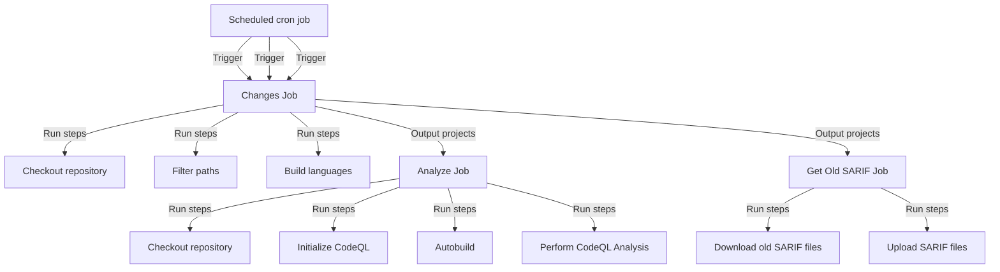

```mermaid
graph TD
    A[Push to main branch] -->|Trigger| B[Changes Job]
    A[Pull request to main branch] -->|Trigger| B[Changes Job]
    A[Scheduled cron job] -->|Trigger| B[Changes Job]
    
    B[Changes Job] -->|Run steps| C[Checkout repository]
    B[Changes Job] -->|Run steps| D[Filter paths]
    B[Changes Job] -->|Run steps| E[Build languages]
    
    B[Changes Job] -->|Output projects| F[Analyze Job]
    
    F[Analyze Job] -->|Run steps| G[Checkout repository]
    F[Analyze Job] -->|Run steps| H[Initialize CodeQL]
    F[Analyze Job] -->|Run steps| I[Autobuild]
    F[Analyze Job] -->|Run steps| J[Perform CodeQL Analysis]
    
    B[Changes Job] -->|Output projects| K[Get Old SARIF Job]
    
    K[Get Old SARIF Job] -->|Run steps| L[Download old SARIF files]
    K[Get Old SARIF Job] -->|Run steps| M[Upload SARIF files]
```
